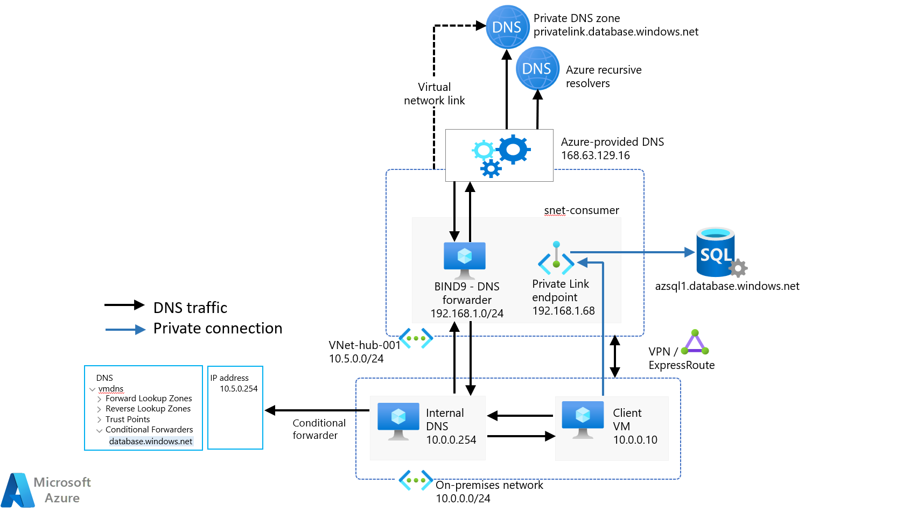

# DNS Forwarder for Azure using Ubtuntu BIND9 - Install and Configuration scripts

Azure Private Endpoint require DNS for name resolution. Microsoft has two options to provide DNS resolution for this requirement, the first is Azure DNS Resolver and the second is using a DNS forwarder on a container or virtual machine.

The repo will provide an option using BIND9 running on Ubuntu VM.

## Scripts

**install_bind.sh** script can be used for the deployment of BIND9 and configuration on deployment of a VM using an Azure Extension or run as a custom script post virtual machine deployment.

The script will configure the following.

- Configuration of logging and enabling BIND to capture logs
- Ability to lock down IP range that can use the DNS resolver
- Forwarders are config using Google DNS and Cloud Flair for example DNS resolvers. This can be replaced by any DNS server on-premises or ISP. The server will just need to answer TCP/UDP requests.
- Private endpoint forwarding for most of Australia region private endpoint zones, these can be.

**config_bind.sh** script allows the administrator to update the BIND9 configuration without the need to reinstall all the services. This script is just a copy of the install script without the install services and log file setup configuration.

## Overview of the flow

